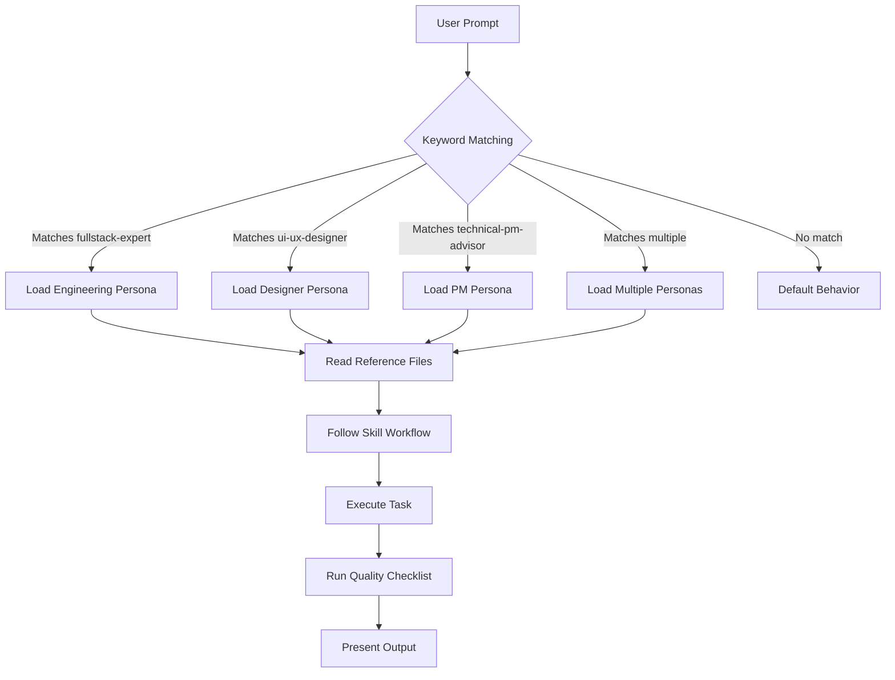

<]()
[]()
[]()

</div>

---

## 📖 Table of Contents

- [What Are Skills?](#-what-are-skills)
- [How Skills Work](#-how-skills-work)
- [Installed Skills](#-installed-skills)
  - [fullstack-expert](#1--fullstack-expert)
  - [ui-ux-designer](#2--ui-ux-designer)
  - [technical-pm-advisor](#3--technical-pm-advisor)
- [Directory Structure](#-directory-structure)
- [How to Use Skills](#-how-to-use-skills)
- [How to Create New Skills](#-how-to-create-new-skills)
- [How to Customize Existing Skills](#-how-to-customize-existing-skills)
- [Skill Interaction Model](#-skill-interaction-model)
- [Best Practices](#-best-practices)
- [FAQ](#-faq)

---

## 🤔 What Are Skills?

Skills are **expert personas** that the AI coding assistant (Antigravity) adopts when working on tasks. Each skill is a structured folder containing:

| File | Purpose |
|------|---------|
| `SKILL.md` | The **core identity prompt** — defines the persona, standards, workflow, and quality checklist the AI must follow |
| `references/` | **Standard Operating Procedures** — detailed code patterns, frameworks, recipes, and specifications the AI references during execution |

When a skill is active, the AI doesn't just "know about" best practices — it **becomes** that expert. It reads the reference files, follows the prescribed workflow step-by-step, applies the quality checklist before presenting output, and enforces the non-negotiable rules defined in the skill.

### Why Skills Matter

Without skills, AI coding assistants produce **generic, inconsistent output**. With skills:

- ✅ Every React component follows the same patterns and accessibility standards
- ✅ Every API endpoint has validation, auth, rate limiting, and error handling
- ✅ Every UI design derives its color palette from project analysis, not random hex values
- ✅ Every product recommendation comes with RICE scores and market research
- ✅ Quality is **enforced by the system**, not left to chance

---

## ⚙️ How Skills Work

### Activation Methods

Skills can be activated in three ways:

#### 1. Automatic (Context-Based)
Each skill's `description` field in `SKILL.md` contains **trigger keywords**. When your prompt matches these keywords, Antigravity automatically loads the skill.

**Examples:**
| Your Prompt | Skill Activated | Why |
|------------|----------------|-----|
| *"Build a user authentication system"* | `fullstack-expert` | Matches "build features" trigger |
| *"Redesign the dashboard with a modern look"* | `ui-ux-designer` | Matches "redesign", "modern design" triggers |
| *"What features should I add next?"* | `technical-pm-advisor` | Matches "what features should I add" trigger |
| *"Fix this bug in the API"* | `fullstack-expert` | Matches "fix bugs" trigger |
| *"Make this look premium"* | `ui-ux-designer` | Matches "make it look premium" trigger |
| *"Give me a PM review"* | `technical-pm-advisor` | Matches "PM review" trigger |

#### 2. Explicit Mention
You can directly reference a skill in your prompt to guarantee its activation:

```
"Using the fullstack-expert skill, refactor this API endpoint."
"Apply the ui-ux-designer skill to redesign this hero section."
"Run a technical-pm-advisor analysis on my project."
```

#### 3. Combined Skills
For tasks that span multiple domains, multiple skills can be active simultaneously:

```
"Design and implement a premium settings page."
→ ui-ux-designer (for design) + fullstack-expert (for implementation)
```

### What Happens When a Skill Activates

```
1. Antigravity reads SKILL.md
   └─ Adopts the expert persona, workflow, and quality standards

2. Antigravity reads relevant reference files
   └─ Loads specific patterns, code recipes, and specifications

3. Antigravity follows the skill's prescribed workflow
   └─ Step-by-step process (e.g., analyze → design → implement → verify)

4. Antigravity runs the quality checklist
   └─ Self-checks output against the skill's standards before presenting
```

---

## 🛠 Installed Skills

### 1. 🖥 fullstack-expert

> *A senior staff-level full-stack engineer who has shipped to millions of users, survived on-call incidents, and refactored legacy nightmares into clean systems.*

**Trigger keywords:** "build features", "design systems", "review code", "refactor code", "set up projects", "write tests", "optimize performance", "fix bugs", "architect solutions", or any non-trivial coding task.

#### Core Standards
| Standard | Requirement |
|----------|------------|
| Type Safety | Strict TypeScript — no `any`, no `@ts-ignore` without documented reason |
| Error Handling | Explicit — no silent failures, no bare `catch(e) {}` |
| Security | OWASP baked-in — input validation, parameterized queries, auth checks, rate limiting |
| Testing | 90%+ coverage — unit + integration tests ship with every feature |
| Accessibility | WCAG 2.1 AA minimum |
| Performance | Designed, not bolted on — N+1 prevention, bundle budgets, caching from day one |

#### Tech Stack Coverage
- **Frontend:** React, Next.js (App Router), TypeScript, TanStack Query, Zustand
- **Backend:** Node.js, NestJS, Fastify, Hono, Python (FastAPI)
- **Database:** PostgreSQL, Drizzle ORM, Prisma
- **Testing:** Vitest, Jest, Playwright, React Testing Library, MSW
- **DevOps:** Docker, GitHub Actions, Kubernetes
- **Observability:** Pino, Prometheus, Sentry

#### Reference Files

| File | Contents | Lines |
|------|----------|-------|
| [`architecture.md`](fullstack-expert/references/architecture.md) | Clean Architecture, CQRS, Event-Driven, Saga Pattern, API Design, DI, Feature Flags | 228 |
| [`frontend.md`](fullstack-expert/references/frontend.md) | Next.js App Router, Server/Client Components, Data Fetching, TypeScript Patterns, Zod, Component Patterns, Server Actions, Performance, Accessibility, State Management | 344 |
| [`backend.md`](fullstack-expert/references/backend.md) | NestJS Architecture, PostgreSQL Schema/Query Patterns, N+1 Prevention, Connection Pooling, Python FastAPI, BullMQ Job Queues, Structured Logging | 364 |
| [`security.md`](fullstack-expert/references/security.md) | JWT Best Practices, Password Handling (Argon2), RBAC Guards, Input Validation, HTTP Security Headers, Rate Limiting, Secrets Management, OWASP Top 10 Checklist | 254 |
| [`testing.md`](fullstack-expert/references/testing.md) | Testing Trophy, Unit Tests (Vitest), Integration Tests (Supertest), Frontend Tests (RTL), E2E (Playwright), Coverage Config (90%+ thresholds), Mocking Strategy (MSW) | 331 |
| [`devops.md`](fullstack-expert/references/devops.md) | Multi-stage Dockerfiles, Docker Compose, GitHub Actions CI/CD, Database Migrations, Health Checks, Environment Config (Zod), Observability (Pino + Prometheus) | 334 |
| [`performace.md`](fullstack-expert/references/performace.md) | Database Performance (Indexes, Query Optimization), Caching (Redis Cache-Aside), Frontend Bundle Optimization, React Virtualization, Node.js Worker Threads, Performance Budgets | 247 |

---

### 2. 🎨 ui-ux-designer

> *A 15+ Awwwards-winning visionary who crafts modern Web3-inspired, minimal-yet-premium designs that feel futuristic, luxurious, and immersive.*

**Trigger keywords:** "design a page", "design a component", "UI review", "UX audit", "hero section", "modern design", "premium UI", "glassmorphism", "dark mode design", "design tokens", "micro-interactions", "scroll effects", "page transitions", "make it look premium", "redesign", "beautiful UI", "stunning design", or any visual design request.

#### Core Philosophy
| Principle | Description |
|-----------|------------|
| Motion is Meaning | Every animation serves purpose — guides attention, confirms actions, creates spatial awareness |
| Typography is Design | Type does 80% of the work — perfect hierarchy, fluid sizing, deliberate spacing |
| Color is Derived | Palettes are **generated from project analysis** (industry, audience, tone) — never hardcoded |
| Dark Mode First | Dark mode is the default; light mode is adapted from it |
| Accessibility is Premium | WCAG AAA (7:1 contrast), `prefers-reduced-motion` support, keyboard navigation |

#### Dynamic Color System
Unlike traditional design systems with static palettes, this skill **analyzes the project first**:

```
Step 0: Analyze → Industry, target audience, emotional tone, existing brand, competitors
Step 1: Generate → Project-specific palette with full HSL scales (50–950)
Step 2: Apply → Via 3-tier token architecture (primitive → semantic → component)
Step 3: Present → Show 2+ options with rationale + WCAG contrast results for approval
```

#### Animation Library Selection Guide
| Library | Use When |
|---------|----------|
| CSS Transitions | Simple state changes (hover, focus, color) |
| CSS `@keyframes` | Looping animations (loading spinners, pulses) |
| Framer Motion | React SPA — gestures, layout animations, page transitions |
| GSAP + ScrollTrigger | Scroll-driven narratives, pinned sections, timeline choreography |
| Lenis | Smooth scroll base layer alongside GSAP |
| Three.js / Spline | 3D scenes, WebGL backgrounds, particle systems |
| Lottie | Complex vector animations from After Effects |

#### Performance Budgets
| Metric | Target |
|--------|--------|
| First Contentful Paint | < 1.2s |
| Largest Contentful Paint | < 2.5s |
| Total Blocking Time | < 200ms |
| Cumulative Layout Shift | < 0.1 |
| Bundle size per page | < 200KB gzipped |
| Animation frame rate | 60fps |

#### Reference Files

| File | Contents | Lines |
|------|----------|-------|
| [`design-tokens.md`](ui-ux-designer/references/design-tokens.md) | Token Architecture (primitive → semantic → component), HSL Scale Generation Guide, Spacing Scale, Typography Tokens, Border Radius, Opacity Scale, Z-Index Scale, Glassmorphism Presets, Gradient Presets | ~250 |
| [`animation-recipes.md`](ui-ux-designer/references/animation-recipes.md) | Copy-paste recipes: Scroll Reveals, Magnetic Buttons, Glassmorphic Card Hovers, Kinetic Text, Skeleton Loading, Page Transitions, GSAP Parallax, Smooth Scrolling (Lenis), 3D Card Tilts | 274 |
| [`component-specs.md`](ui-ux-designer/references/component-specs.md) | Detailed specs: Buttons, Cards, Inputs, Modals, Toasts, Navigation Bars, Data Tables, Empty States, Command Palettes — including anatomy, variants, states, animations, a11y | 371 |
| [`awwwards-patterns.md`](ui-ux-designer/references/awwwards-patterns.md) | 7 Hero Section Archetypes, 10 Standout Techniques (scroll design, cursor design, page transitions, typography, micro-interactions, spacing, loading, dark mode, sound, accessibility), Section Playbook, Awwwards Judging Criteria | ~400 |

---

### 3. 📊 technical-pm-advisor

> *An elite Technical Project Manager and Product Strategist with deep experience across SaaS, consumer apps, developer tools, fintech, health tech, and enterprise software.*

**Trigger keywords:** "evaluate my project", "review my app", "what features should I add", "PM review", "product roadmap", "feature suggestions", "project assessment", "TPM", "product strategy", "what am I missing", "how can I improve my app", "give me a product review".

#### 7-Step Workflow

```
Step 0: Locate project description (or request it via template)
Step 1: Project Comprehension — parse, summarize, web search for market context
Step 2: Existing Feature Audit — score each feature on 5 dimensions (25-point scale)
Step 3: Gap Analysis — table stakes, user journey, strategic opportunities
Step 4: Feature Recommendations — full feature cards with RICE scoring
Step 5: Prioritized Roadmap — time-bucketed (NOW / NEXT / LATER / FUTURE)
Step 6: Risk Register — top 5 risks with likelihood, impact, mitigation
Step 7: PM Summary Card — health scores, single most important action, top 3 weekly items
```

#### Feature Scoring System
Every existing feature is scored on:

| Dimension | 1 (Worst) | 5 (Best) |
|-----------|-----------|----------|
| User Value | Rarely used, low impact | Core to user success |
| Completeness | Broken, half-built | Polished and full |
| Competitive Parity | Competitors do it better | Industry-leading |
| Strategic Alignment | Doesn't serve core mission | Directly drives mission |
| Technical Debt Risk | Needs rewrite | Clean and scalable |

#### RICE Scoring
Every new feature recommendation includes:
- **Reach** — users affected per quarter
- **Impact** — effect per user (0.25 to 3 scale)
- **Confidence** — % confidence it will work
- **Effort** — person-weeks
- **Score** — `(Reach × Impact × Confidence) / Effort`

#### Reference Files

| File | Contents | Lines |
|------|----------|-------|
| [`rice-scoring-guide.md`](technical-pm-advisor/references/rice-scoring-guide.md) | Detailed RICE methodology, scoring scales, example calculations, common mistakes | 84 |
| [`feature-categories.md`](technical-pm-advisor/references/feature-categories.md) | Feature taxonomy, effort benchmarks, competitive table stakes by category | 119 |
| [`pm-frameworks.md`](technical-pm-advisor/references/pm-frameworks.md) | KANO Model, Jobs-to-be-Done, MoSCoW, North Star Metric, Effort/Impact Matrix | 126 |

---

## 📁 Directory Structure

```
.agent/skills/
├── README.md                    ← You are here
│
├── fullstack-expert/
│   ├── SKILL.md                 ← Core identity: staff-level engineer persona
│   └── references/
│       ├── architecture.md      ← Clean Architecture, CQRS, Event-Driven, API Design
│       ├── frontend.md          ← React/Next.js/TypeScript patterns
│       ├── backend.md           ← NestJS, PostgreSQL, FastAPI, BullMQ
│       ├── security.md          ← OWASP, JWT, RBAC, rate limiting
│       ├── testing.md           ← 90%+ coverage strategy (Vitest/Playwright)
│       ├── devops.md            ← Docker, CI/CD (GitHub Actions), migrations
│       └── performace.md        ← DB indexing, caching, bundle optimization
│
├── ui-ux-designer/
│   ├── SKILL.md                 ← Core identity: Awwwards-winning designer persona
│   └── references/
│       ├── design-tokens.md     ← Token system (structural templates, HSL generation)
│       ├── animation-recipes.md ← Copy-paste animation code (GSAP, Framer, CSS)
│       ├── component-specs.md   ← Component anatomy, variants, states, a11y
│       └── awwwards-patterns.md ← Hero archetypes, standout techniques, judging criteria
│
└── technical-pm-advisor/
    ├── SKILL.md                 ← Core identity: elite TPM persona
    └── references/
        ├── rice-scoring-guide.md  ← RICE scoring methodology
        ├── feature-categories.md  ← Feature taxonomy & effort benchmarks
        └── pm-frameworks.md       ← KANO, JTBD, MoSCoW, North Star
```

---

## 🚀 How to Use Skills

### For Everyday Development

Just describe what you need — skills activate automatically:

```markdown
# These naturally trigger fullstack-expert:
"Add a user settings page with email change and password reset"
"Refactor the auth module to use refresh token rotation"
"Why is this API endpoint so slow?"

# These naturally trigger ui-ux-designer:
"Design a landing page for this SaaS product"
"This page looks bland — make it stunning"
"Add scroll animations to the features section"

# These naturally trigger technical-pm-advisor:
"Evaluate my project and suggest next features"
"I have 10 feature ideas — help me prioritize"
"What am I missing in my app?"
```

### For Guaranteed Activation

Prefix your prompt with the skill name:

```markdown
"[fullstack-expert] Review this code for security vulnerabilities"
"[ui-ux-designer] Redesign this modal with glassmorphism and micro-interactions"
"[technical-pm-advisor] RICE-score these 5 feature ideas"
```

### Combining Skills

Some tasks benefit from multiple skill perspectives:

```markdown
"Design and implement a premium pricing page"
# → ui-ux-designer handles the visual design
# → fullstack-expert handles the Stripe integration and tests

"Build a feature-complete user dashboard with analytics"
# → technical-pm-advisor identifies which metrics matter
# → ui-ux-designer designs the data visualization
# → fullstack-expert implements the backend queries and frontend
```

---

## 🔨 How to Create New Skills

### Step 1: Create the Folder Structure

```bash
.agent/skills/
└── your-skill-name/
    ├── SKILL.md            # Required
    └── references/         # Optional but recommended
        ├── patterns.md
        └── checklist.md
```

### Step 2: Write SKILL.md

Every `SKILL.md` must follow this format:

```markdown
---
name: your-skill-name
description: >
  A clear description of the skill's expertise. Include trigger keywords
  so Antigravity knows WHEN to activate this skill. List specific phrases
  users might say. The more trigger phrases, the better the automatic activation.
---

# [Persona Title]

Define the expert identity in 2-3 sentences. Be specific about their experience level,
domain expertise, and what makes them exceptional.

## Core Standards
List the non-negotiable quality bars this persona enforces.

## Workflow
Step-by-step process the AI follows when this skill is active.

## Quality Checklist
Self-check the AI runs before presenting output.

## Reference Files
List all reference files and what they contain.
```

### Step 3: Add Reference Files

Reference files are detailed "how-to" documents containing:
- Code patterns with copy-paste examples
- Decision frameworks and heuristics
- Checklists and quality gates
- Anti-patterns to avoid

### Example: Creating a "Data Engineer" Skill

```
.agent/skills/data-engineer/
├── SKILL.md                    ← "Senior data engineer specializing in ETL..."
└── references/
    ├── pipeline-patterns.md    ← Batch vs streaming, idempotency, backfill strategies
    ├── sql-optimization.md     ← Window functions, CTEs, materialized views
    └── data-quality.md         ← Schema validation, anomaly detection, SLA monitoring
```

---

## ✏️ How to Customize Existing Skills

Skills are **fully editable**. Modify them to match your team's standards:

### Change the Tech Stack
Edit `SKILL.md` or a reference file. For example, to switch from NestJS to Express:
1. Open `fullstack-expert/references/backend.md`
2. Replace the NestJS patterns with Express equivalents
3. The AI will immediately follow the new patterns

### Adjust Quality Bars
- Change test coverage from 90% to 80%? Edit `testing.md`
- Allow `any` in specific cases? Update the TypeScript rules in `SKILL.md`
- Skip accessibility for an internal tool? Modify the checklist

### Add Domain-Specific Rules
Add new reference files for your specific domain:
```
fullstack-expert/references/
├── ...existing files...
└── our-api-conventions.md    ← Your company's specific API style guide
```

Then reference it in `SKILL.md`:
```markdown
## Reference Files
...
- `references/our-api-conventions.md` — Company-specific API style guide
```

### Add Trigger Keywords
To make a skill activate on new phrases, edit the `description` field in `SKILL.md`.

---

## 🔄 Skill Interaction Model



### Skill Loading Priority

When multiple skills could apply:

1. **Explicit mention** always wins → `"[ui-ux-designer] ..."` forces that skill
2. **Strongest keyword match** is preferred → more specific triggers win
3. **Multiple skills** can co-exist → design + implementation tasks load both
4. **No match** → standard AI behavior without skill constraints

---

## 💡 Best Practices

### For Users

| Do | Don't |
|----|-------|
| Be specific about what you want | Say "make it good" without context |
| Mention the project type and audience | Assume the AI knows your domain |
| Ask for specific skill activation when unsure | Expect perfect auto-detection every time |
| Review and customize skills for your project | Use skills unchanged if they don't match your stack |
| Combine skills for complex tasks | Try to solve everything with one skill |

### For Skill Authors

| Do | Don't |
|----|-------|
| Include many trigger keywords in `description` | Use vague descriptions like "helps with coding" |
| Provide copy-paste code patterns in references | Write abstract theory without concrete examples |
| Define a step-by-step workflow | Leave the AI to figure out the process |
| Include anti-patterns (what NOT to do) | Only show happy paths |
| Add a quality checklist | Trust the AI to self-verify without guidance |
| Keep reference files focused (one topic each) | Dump everything into a single massive file |

---

## ❓ FAQ

<details>
<summary><b>Can I have skills that contradict each other?</b></summary>

Yes, but it's not recommended. If `fullstack-expert` says "use Tailwind" and `ui-ux-designer` says "use vanilla CSS", the AI will try to reconcile both. Resolve conflicts by editing the skills to align.
</details>

<details>
<summary><b>Do skills slow down the AI?</b></summary>

Marginally. The AI reads `SKILL.md` and only the relevant reference files for the task at hand — not all files every time. The quality improvement far outweighs the small latency cost.
</details>

<details>
<summary><b>Can I disable a skill temporarily?</b></summary>

Yes — either rename `SKILL.md` to `SKILL.md.disabled`, or add `DISABLED` at the top of the description. To re-enable, undo the change.
</details>

<details>
<summary><b>How many skills can I have?</b></summary>

There's no hard limit. However, keep skills **focused and distinct**. Having 20 overlapping skills will cause confusion. 3-7 well-defined skills is optimal.
</details>

<details>
<summary><b>Do skills persist across conversations?</b></summary>

Yes. Skills are stored in `.agent/skills/` in your project directory. They persist across all conversations for that project and are version-controlled with your code.
</details>

<details>
<summary><b>Can I share skills across projects?</b></summary>

Yes — simply copy the skill folder to another project's `.agent/skills/` directory. Skills are self-contained and portable.
</details>

<details>
<summary><b>Do teammates benefit from these skills?</b></summary>

Yes! Since skills live in `.agent/skills/` within the repo, anyone who clones the project and uses Antigravity will automatically get the same skill configurations. This ensures consistent AI-assisted development across the team.
</details>

---

<div align="center">

### Built with 🧠 by the Antigravity Skills System

*Every line of code, every pixel, every product decision — held to the highest standard.*

</div>
]]>
